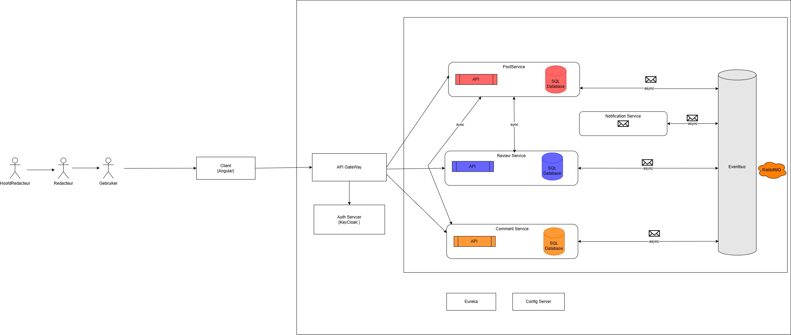

# Architecture

## Client (Angular)

De client maakt gebruik van Angular voor de front-end applicatie die met de verschillende microservices communiceert via de API Gateway.

## API Gateway
In dit project fungeert de gateway-service als tussenpersoon die inkomende verzoeken van clients naar de juiste microservices doorstuurt. Het maakt gebruik van **Eureka** voor service discovery, wat betekent dat het automatisch de locatie van de microservices kan vinden en verzoeken naar hen kan routeren.

## Auth Server [Keycloak]
**Keycloak** wordt in de **AuthService** gebruikt om de gebruikersnaam en rol van de gebruiker lokaal te beheren. De **AuthService** wordt geïnjecteerd in de componenten en gebruikt om de gebruikersnaam van de ingelogde gebruiker op te halen met de methode `getUsername()`. 

De **AuthService** is verantwoordelijk voor het beheren van gebruikersauthenticatie en -autorisatie. Het biedt methoden om de gebruikersnaam en rol van de momenteel ingelogde gebruiker in te stellen en op te halen, te controleren of een gebruiker is ingelogd en de gebruiker uit te loggen. Hier is een korte uitleg van de methoden:
- **setUser(username: string, role: 'redacteur' | 'lezer')**: Stelt de gebruikersnaam en rol van de gebruiker in.
- **getUsername()**: Retourneert de gebruikersnaam van de momenteel ingelogde gebruiker.
- **getRole()**: Retourneert de rol van de momenteel ingelogde gebruiker.
- **isLoggedIn()**: Controleert of een gebruiker is ingelogd door te verifiëren of zowel de gebruikersnaam als de rol niet null zijn.
- **logout()**: Logt de gebruiker uit door de gebruikersnaam en rol naar null in te stellen.

## Post Service (Open-Feign)
De **Post Service** is verantwoordelijk voor het beheer van de berichten. Het verwerkt bewerkingen zoals het maken, ophalen, bijwerken en verwijderen van berichten. Het kan ook communiceren met andere diensten, zoals de comment- of review-service, om uitgebreide functionaliteit te bieden. Dit gebeurt ook via **RabbitMQ** om goedkeuring van een post aan te vragen bij de **Review Service**.

Voorbeeldfuncties van de post service:
- **Bericht maken**: Hiermee kunnen gebruikers nieuwe berichten maken.
- **Bericht ophalen**: Haalt details van een specifiek bericht op aan de hand van zijn ID.
- **Bericht bijwerken**: Werkt de inhoud of metagegevens van een bestaand bericht bij.
- **Bericht verwijderen**: Verwijdert een bericht uit het systeem.
- **Lijst van berichten**: Haalt een lijst op met alle berichten of berichten op basis van specifieke criteria.

**OpenFeign** wordt gebruikt in de klasse **CommentClient** om met de **Comment Service** te communiceren en het aantal reacties op een bericht te achterhalen.

## Review Service (Open-Feign)
De **Review Service** is verantwoordelijk voor het beheer van het beoordelingsproces van berichten. Het verwerkt handelingen zoals het toevoegen van berichten ter beoordeling, het goedkeuren of afwijzen van berichten en het informeren van auteurs via e-mail. Het werkt ook samen met andere diensten, zoals de **Post Service**, om berichtdetails op te halen en gebruikt **RabbitMQ** voor berichtenuitwisseling.

Belangrijkste functies van de review service:
- **Bericht ter beoordeling toevoegen**: Voegt een bericht toe aan de beoordelingswachtrij.
- **Bericht goedkeuren**: Keurt een bericht goed en stelt de auteur hiervan via e-mail op de hoogte.
- **Bericht afwijzen**: Weigert een bericht met een afwijzingsbericht en stelt de auteur hiervan via e-mail op de hoogte.
- **Berichten ophalen ter beoordeling**: Haalt berichten op die moeten worden beoordeeld, met uitzondering van berichten van een specifieke auteur.

**OpenFeign** wordt in de klasse **PostClient** gebruikt om met de **Post Service** te communiceren.

## Comment Service
De **Comment Service** is verantwoordelijk voor het beheren van reacties met betrekking tot berichten. Het verwerkt bewerkingen zoals het maken, ophalen, bijwerken en verwijderen van opmerkingen. Het biedt ook functionaliteit om het aantal reacties op een specifiek bericht te tellen.

Belangrijkste functies van de comment service:
- **Opmerking maken**: Hiermee kunnen gebruikers nieuwe opmerkingen maken voor een specifiek bericht.
- **Opmerkingen ophalen**: Haalt alle opmerkingen op die aan een specifiek bericht zijn gekoppeld.
- **Opmerking bijwerken**: Werkt de inhoud of metagegevens van een bestaande opmerking bij.
- **Opmerking verwijderen**: Verwijdert een opmerking uit het systeem.
- **Reacties tellen**: Haalt het aantal reacties op voor een specifiek bericht.

## Discovery Service (Eureka)
**Eureka** wordt gebruikt voor service discovery. De gateway-service registreert zichzelf bij de Eureka-server en ontdekt andere microservices die ook bij Eureka zijn geregistreerd. Dit maakt dynamische routing mogelijk zonder dat de exacte locaties van de microservices hardcoded hoeven te zijn.

## Config Server
De **Config Server** fungeert als een centrale configuratieserver die configuratie-instellingen voor alle microservices beheert. Het maakt gebruik van **Spring Cloud Config** om configuratiegegevens op te slaan en te distribueren, wat zorgt voor gecentraliseerd beheer van configuratiebestanden.

## Messaging Service (RabbitMQ)
De **Messaging Service** is verantwoordelijk voor het verzenden en ontvangen van berichten tussen microservices, met name tussen de **Post Service** en de **Review Service**. Het maakt gebruik van **RabbitMQ** als message broker om de communicatie tussen deze services te faciliteren.

Functies van de Messaging Service:
- **Berichten Verzenden**: Verstuurt berichten naar andere microservices via RabbitMQ.
- **Berichten Ontvangen**: Ontvangt berichten van andere microservices via RabbitMQ.
- **Asynchrone Communicatie**: Ondersteunt asynchrone communicatie tussen microservices, wat zorgt voor een losgekoppelde en schaalbare architectuur.
- **Betrouwbare Berichtenaflevering**: Zorgt voor betrouwbare aflevering van berichten door gebruik te maken van RabbitMQ's bevestigingsmechanismen.
